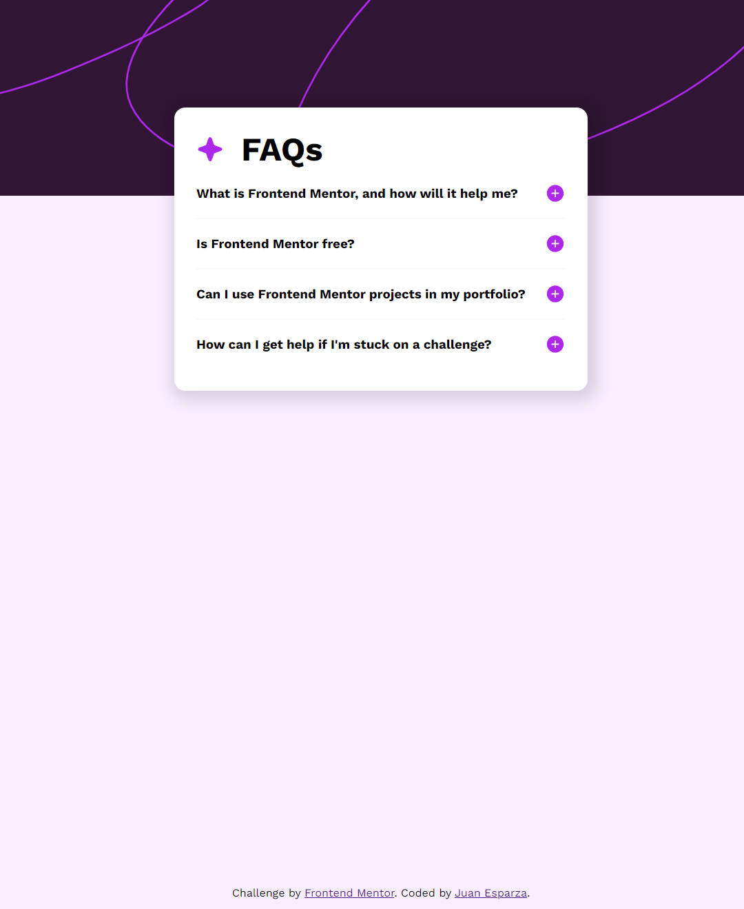
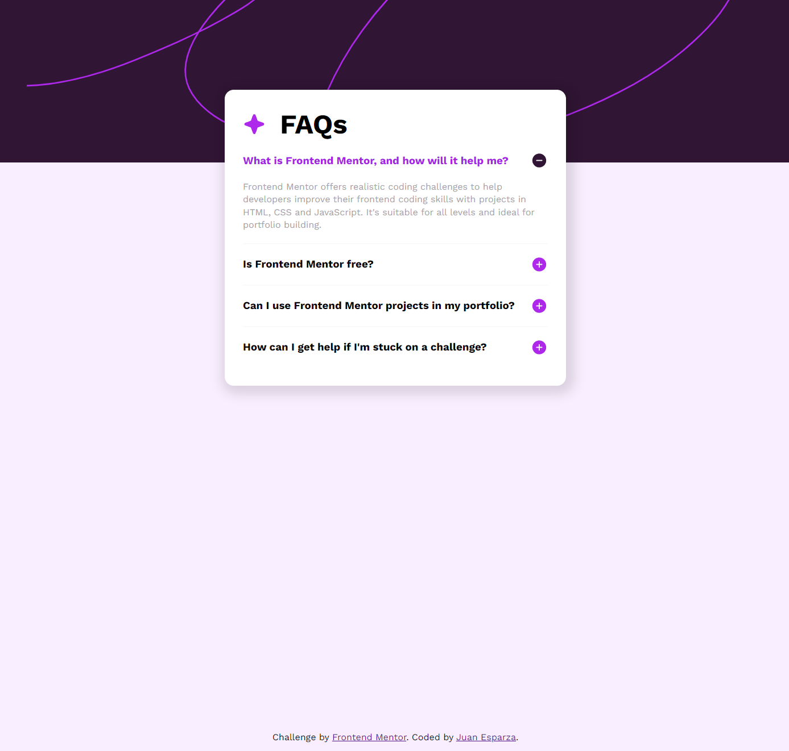

# Frontend Mentor - FAQ accordion solution

This is a solution to the [FAQ accordion challenge on Frontend Mentor](https://www.frontendmentor.io/challenges/faq-accordion-wyfFdeBwBz). Frontend Mentor challenges help you improve your coding skills by building realistic projects.

## Table of contents

- [Overview](#overview)
  - [The challenge](#the-challenge)
  - [Screenshot](#screenshot)
  - [Built with](#built-with)
  - [What I learned](#what-i-learned)
  - [Continued development](#continued-development)
- [Acknowledgments](#acknowledgments)

## Overview

### The challenge

Users should be able to:

- Hide/Show the answer to a question when the question is clicked
- Navigate the questions and hide/show answers using keyboard navigation alone
- View the optimal layout for the interface depending on their device's screen size
- See hover and focus states for all interactive elements on the page

### Screenshot

;

## My process

### Built with

- Semantic HTML5 markup
- CSS custom properties
- Flexbox

### What I learned

Practiced flex box and absolute positioning. Learned how to make paragraphs not take the whole screen using the max-width property.
the differences between min-width and width while making the mobile design. And the use of media queries. (I'm still not sure if that was the correct breakpoint).

### Continued development

I will continue learning responsive design. I still can't get the fundamentals so when i use pixels in the design i fear that it won't be responsive.

I will learn css animations and transitions so i can give a better feel to my designs.

## Acknowledgments

I Want to thank the Frontend Mentor community for all their help and useful comments. It was really heartwarming and it motivates me to keep learning and trying out the challenges.
